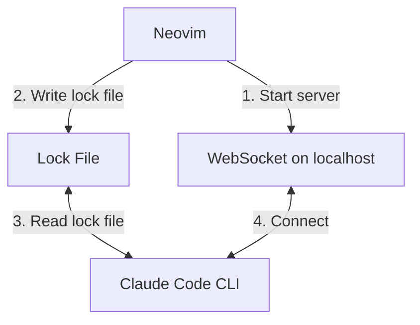

```mermaid
graph TD
    N[Neovim] -->|2. Write lock file| LF[Lock File]
    N -->|1. Start server| WS[WebSocket on localhost]
    LF <-->|3. Read lock file| C[Claude Code CLI]
    WS <-->|4. Connect| C
```
