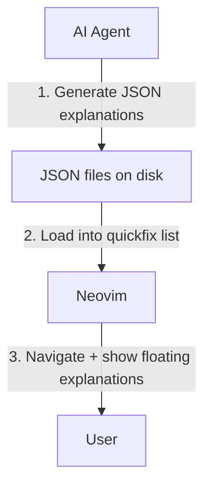

```mermaid
graph TD
    A[AI Agent] -->|1. Generate JSON explanations| J[JSON files on disk]
    J -->|2. Load into quickfix list| N[Neovim]
    N -->|3. Navigate + show floating explanations| U[User]
```
