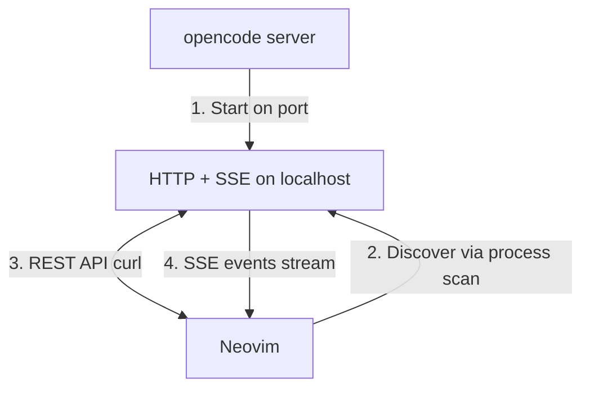

```mermaid
graph TD
    OC[opencode server] -->|1. Start on port| HTTP[HTTP + SSE on localhost]
    N[Neovim] -->|2. Discover via process scan| HTTP
    HTTP <-->|3. REST API curl| N
    HTTP -->|4. SSE events stream| N
```
