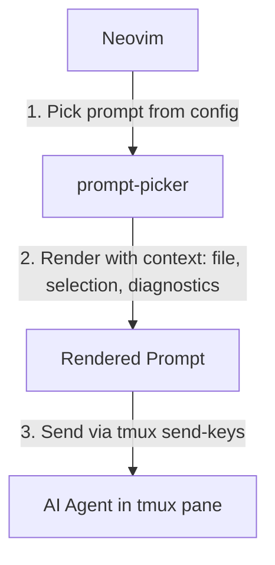

```mermaid
graph TD
    N[Neovim] -->|1. Pick prompt from config| P[prompt-picker]
    P -->|2. Render with context: file, selection, diagnostics| T[Rendered Prompt]
    T -->|3. Send via tmux send-keys| A[AI Agent in tmux pane]
```
